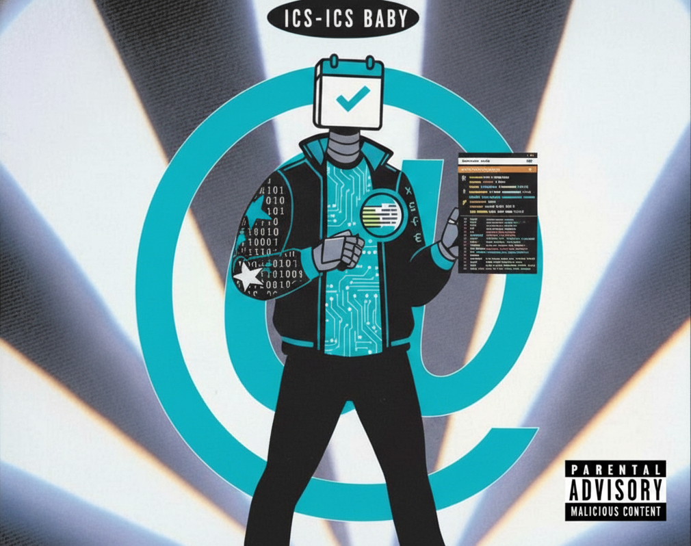

# ics-ics-baby https://suno.com/s/KuqOpEIg8A2YG9VL 


`ics-ics-baby` is a CLI workbench for tearing apart suspicious calendar invites. It parses `.ics` payloads, extracts everything useful (events, tasks, free/busy, attachments, vcards), and emits:

- a JSON manifest summarising the invite
- an HTML preview suitable for quick eyeballing
- a PNG rendering for embedding into reports or tickets
- any attachments referenced by the calendar item

Security-oriented heuristics drive the renderer: descriptions are normalised for readability, rich HTML is sanitised before display, and conference/URL metadata is preserved for downstream tooling.

## Features

- **Full RFC 5545 coverage**: events, todos, free/busy, alarms, timezones, `X-*` vendor properties, and vCards.
- **Dual description handling**: both plain `DESCRIPTION` text and `X-ALT-DESC` HTML are captured and exposed as `description` / `description_html`.
- **Renderer parity**: HTML and PNG previews share the same sanitised content and annotate attendees, organisers, alarms, recurrence, attachments, and discovered URLs.
- **Attachment extraction**: inline base64 blobs (including vCards) and remote links are saved into the output directory.
- **URL harvesting**: every description/todo body is scanned for URLs and surfaced in the manifest.

## Quick Start

```bash
# build once (optional)
go build ./cmd/ics-ics-baby

# or run directly
GOCACHE=$(pwd)/.gocache go run ./cmd/ics-ics-baby \
  --out out/badinvite1 \
  --html out/badinvite1/ics-ics-baby-preview.html \
  --screenshot out/badinvite1/ics-ics-baby-preview.png \
  --download-attachments \
  /path/to/suspect.ics
```

Outputs land in `out/<slug>/` by default:

- `ics-ics-baby-manifest.json`
- `ics-ics-baby-preview.html`
- `ics-ics-baby-preview.png`
- `ics-ics-baby-attachments/…`

## Renderer Preview

- **HTML (`ics-ics-baby-preview.html`)** — system fonts, clickable links, sanitised HTML descriptions, attendee email annotations.
- **PNG (`ics-ics-baby-preview.png`)** — OCR-friendly Go Regular font, matching layout to the HTML version.

Both surfaces italicise suspicious data with bullets and chips, making it easy to scan alarm triggers, attachments, and conference joins.

## Testing

```bash
GOCACHE=$(pwd)/.gocache go test ./...
```

Tests cover the parser (including description sanitisation) and ensure new fields hit the manifest. Before packaging, regenerate outputs for any fixture invites with:

```bash
for f in /path/to/invites/*.ics; do
  name=$(basename "$f" .ics)
  GOCACHE=$(pwd)/.gocache go run ./cmd/ics-ics-baby \
    --out "out/$name" \
    --html "out/$name/ics-ics-baby-preview.html" \
    --screenshot "out/$name/ics-ics-baby-preview.png" \
    --download-attachments "$f"
done
```

## Project Layout

- `cmd/ics-ics-baby/` — CLI entrypoint (flag parsing, orchestrating outputs).
- `internal/icsparse/` — calendar/vcard parser, sanitisation, manifest builder.
- `internal/render/` — PNG renderer (invite + agenda views).
- `internal/webview/` — HTML rendering templates.
- `internal/attach/` — attachment detection and extraction utilities.
- `internal/util/` — helpers for slugging, IO, etc.

`dist/` holds cross-platform release bundles produced by `./build.sh`. Each run drops artifacts like:

- `ics-ics-baby_<version>_linux_amd64.tar.gz`
- `ics-ics-baby_<version>_linux_arm64.tar.gz`
- `ics-ics-baby_<version>_darwin_amd64.tar.gz`
- `ics-ics-baby_<version>_darwin_arm64.tar.gz`
- `ics-ics-baby_<version>_windows_amd64.zip`

Every archive contains the compiled CLI, `LICENSE`, helper docs, and optional checksums. The `out/` directory is safe to purge between local runs.
